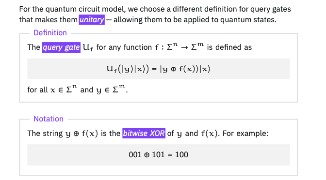

# Quantum Query Algorithms
[Qiskit - fundamentals of quantum algorithms](https://quantum.cloud.ibm.com/learning/en/courses/fundamentals-of-quantum-algorithms/quantum-query-algorithms/introduction)

## Introduction
- standard abstraction of computation:
  - input -> computation -> output
  - Turing machines
  - Boolean circuits 
- input is a string of bits
- **time complexity**: measure speed by counting every single step the CPU takes (adding numbers, moving memory, etc.). 
- Standard Model: Measures total work.
- Query Model: Measures how many times the algorithm have to look at the input.
  - use superposition to query the black box for all possible inputs at the same time.
  - **Grover's Search Algorithm**: Finding a specific item in an unsorted database of N items takes N queries classically. A quantum computer does it in $\sqrt{N}$ queries.
  - **Deutsch-Jozsa Algorithm**: Finding a specific property of a function takes multiple queries classically, but exactly 1 query quantumly.

## The query model of computation
- also known as **Black-Box** or **Oracle model**
- input is a function, which then be accessed by making queries 
  - input/oracle/black-box -- queries --> computation --> output
  - makes a query = evaluates the function f for value x and string f(x) provided
  - efficiency of query algorithms = number of queries to the input 
- **Query**: asking the input for information 
- Query model: a simplified model where we study how many times an algorithm needs to ask for information. 
- Examples of query problems:
  - Or: ask if a specific target exists anywhere in the data
    - returns 1 if at least one prize exists, return 0 if all boxes are empty -> Grover's search
  - Parity : the total count of actives items is odd or even
    - return 0 if find an even number of the target, return 1 if have odd count 
  - Minimum: look at the list of all generated words, finds the single word that comes first in the dictionary (lexicographic order) -> finding the absolute smallest value 
  - Unique search (have a promise on the input)
    - promise: guarantees the data looks a certain way
    - promise that exactly one target exists.

#### Query Gates
- Circuit models of computation - queries are made by query gates.
  - in boolean circuits, query gates compute the function f. 
  - a query gate is straightforward: you input $x$, and the gate outputs $f(x)$ directly
- In quantum computing, we face a major physical constraint: **quantum operations must be reversible (unitary)**
  - Quantum circuit model - query gates is unitary 
  - To solve this, quantum engineers use a special unitary query gate, denoted as $U_f$. Here is how it operates on quantum states: 
    - $$U_f |x\rangle |y\rangle = |x\rangle |y \oplus f(x)\rangle$$
    - The Query Register: The top register $|x\rangle$ holds our query. It is echoed back completely unchanged to preserve our original query information.
    - The Target Register: The bottom register $|y\rangle$ is a target state. The gate takes the function result $f(x)$ and performs a bitwise exclusive-OR (XOR) ($\oplus$) with $y$.
    - Why this is reversible: Because XORing the same value twice cancels it out, this operation is its own inverse7. This reversibility ensures the gate behaves mathematically as a permutation matrix (which simply shuffles vector entries and preserves their mathematical length), making it guaranteed to be unitary and physically realizable.
    - Crucially, because this gate is quantum, we don't have to query one input at a time. We can query the oracle in a superposition of many inputs simultaneously!

#### Why Do We Study This?
It might seem highly theoretical and even contrived to study algorithms for hidden functions
- In fact, when we analyze these algorithms, we completely ignore how difficult it actually is to physically build these oracle gates in the lab.  
However, looking at these idealized limits has led to the greatest breakthroughs in quantum computing:
- The Path to Quantum Advantage: By proving that quantum computers require exponentially fewer queries than classical computers for certain highly contrived problems, scientists proved that quantum advantage is mathematically real.
- Inspiring Real Algorithms: These abstract query algorithms directly inspired practical, world-changing quantum applications. For example, Shor's quantum algorithm for factoring (which can break modern cryptography) was directly inspired by Simon's algorithm, a famous query model problem.

## Deutsch's algorithm
1985 
- Parity problem
  - e.g., given a 2-bit array, index 0 and index 1, each can only store 0 or 1, therefore, there are 4 possible ways the array can be populated.
    - Constant: all elements are the same: 00 or 11
    - Balanced: exactly half are 0, half are 1: 01 or 10
  - Goal: figure out whether the array is constant or balanced = compute the parity or the XOR result of the 2 elements. 
- CLassical bottleneck
  - requires 2 queries: query index 0 and then index 1 to know the result. 
- Quantum Deutsch's algorithm
  - solve in exactly 1 query. 
  - How?
    - Prepare the qubits: 
      - Two qubits in the initial state $|1\rangle |0\rangle$ (reading right-to-left: the top qubit is $|0\rangle$, and the bottom qubit is $|1\rangle$)
      - Pass both qubits through Hadamard gates to put them into superposition. 
        - The top qubit becomes $|+\rangle$.
        - The bottom qubit becomes $|-\rangle$.
    - The Superposition query:
      - Now send both qubits into unitary query gate ($U_f$). Because the top qubit is in a superposition of $|0\rangle$ and $|1\rangle$, we are querying index 0 and index 1 at the exact same time.
    - Phase Kickback:
      - Normally, the $U_f$ gate is supposed to write the array's data onto the bottom qubit. But because the bottom qubit was prepared in the special $|-\rangle$ state, something highly counterintuitive happens:
        - The bottom qubit does not change at all (it stays as $|-\rangle$)
        - Instead, the output value $f(x)$ gets "kicked back" as a negative sign (a phase change) onto the top qubit!
      - Mathematically, this alters the top qubit's state to look like this:
      -  $$\frac{(-1)^{f(0)}|0\rangle + (-1)^{f(1)}|1\rangle}{\sqrt{2}}$$
         -  If we factor out the common term $(-1)^{f(0)}$, the top qubit's state becomes:
         -  $|+\rangle$ if the array is Constant ($f(0) \oplus f(1) = 0$).
         -  $|-\rangle$ if the array is Balanced ($f(0) \oplus f(1) = 1$).
    - Final Measurement:
      - To read this result, we apply one last Hadamard gate to the top qubit to convert it back to the standard basis:
        - If it was Constant ($|+\rangle$), it turns into $|0\rangle$.
        - If it was Balanced ($|-\rangle$), it turns into $|1\rangle$.
      - We measure the top qubit. If we see a 0, we know with 100% certainty the array is constant; if we see a 1, we know it is balanced910. And we only queried the black box once!

## The Deutsch-Jozsa algorithm

## Simon's algorithm